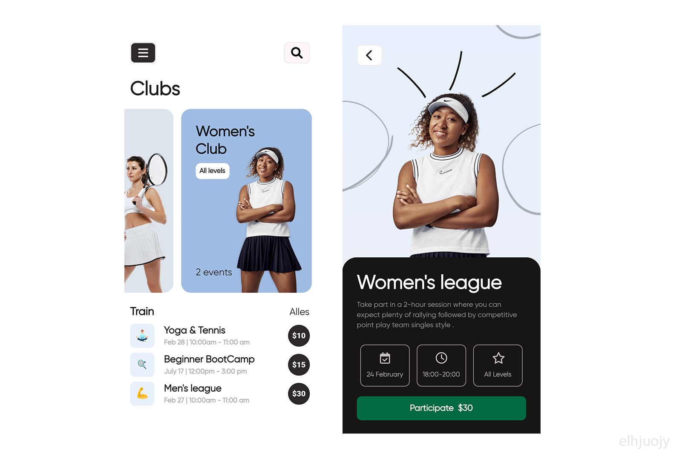

# flutter ui teenis app 

## Development Setup
Clone the repository and run the following commands:
```
flutter pub get
flutter run
```

## ScreenShots
<!--  
  -->

## Links
- 📫 How to reach me **elhajuojye@gmail.com**